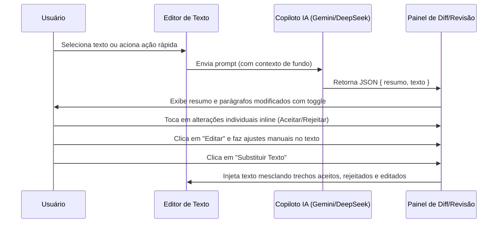

# 🤖 Recursos de IA - teleprompterIA

Este documento detalha o funcionamento, as integrações de API e os algoritmos que capacitam os recursos de Inteligência Artificial do **teleprompterIA**.

---

## 1. Modelos de IA Suportados

O usuário pode alternar facilmente de modelo na janela de configurações gerais. A infraestrutura de backend de IA é unificada em `src/services/gemini.ts` e suporta:

* **Google Gemini (`gemini-2.5-flash` / `gemini-flash-latest`)**:
  * Utiliza o SDK oficial `@google/genai`.
  * Configurado com `responseMimeType: "application/json"` para garantir retornos estruturados.
  * Temperatura de `0.3` para garantir reescritas estilísticas sem alucinações de conteúdo.
* **DeepSeek (`deepseek-v4-flash`)**:
  * Implementação direta de requisição `fetch` HTTPS para o endpoint compatível com OpenAI da DeepSeek (`api.deepseek.com/chat/completions`).
  * Utiliza o parâmetro `response_format: { type: "json_object" }` para impor a mesma estrutura de JSON que o Gemini.
  * Valida automaticamente chaves no fluxo de interface do usuário, permitindo o funcionamento pleno apenas com a chave do DeepSeek configurada.

---

## 2. Estrutura do Contrato de Retorno (JSON Mode)

Para fornecer uma interface rica que não sobrescreve o texto do usuário de forma cega, a IA é instruída a sempre responder no formato JSON:

```json
{
  "resumo": "Explicação muito breve e direta das alterações feitas no texto.",
  "texto": "O roteiro completo ou trecho revisado com as alterações aplicadas."
}
```

### Sanitização e Fallback (`parseAIResponse`)
Alguns provedores ou proxies de rede podem envolver a resposta JSON em blocos de código Markdown do tipo \`\`\`json. O método de tratamento limpa essas strings:
1. Corta espaços em branco e quebras extras nas pontas.
2. Identifica se a string começa com \`\`\` e remove a linha inicial (ex: \`\`\`json) e a linha final (\`\`\`).
3. Efetua o parse JSON.
4. **Fallback**: Se por algum motivo a IA falhar e retornar texto simples sem estrutura JSON (por exemplo, devido a instabilidade na API), o método captura o erro graciosamente e mapeia todo o retorno como a chave `"texto"`, aplicando o resumo genérico `"Texto editado (resposta não estruturada)"` para manter o fluxo operando sem quebras de tela.

---

## 3. Fluxo de Diff Visual e Toggles de Parágrafo (original vs IA)

Quando o Copiloto IA retorna a sugestão de roteiro, ela é carregada no painel direito **"✨ Sugestão da IA"** em vez de ser injetada de imediato no editor.



### O Algoritmo de Alinhamento e Diff de Palavras
* O texto original é dividido em um array de parágrafos: `originalParas = originalText.split('\n')`.
* O texto sugerido pela IA é dividido em um array de parágrafos: `suggestedParas = suggestedText.split('\n')`.
* **Cenário Alinhado (Mesmo número de parágrafos)**:
  * O sistema executa o alinhamento de palavras em cada parágrafo (`getDiffSegments` em `src/utils/text.ts`) usando o algoritmo LCS (Longest Common Subsequence).
  * Consecutivas adições ou remoções de palavras são agrupadas em badges inline clicáveis.
  * **Aceito (Padrão)**: Mostra as palavras sugeridas (verdes) ativas e originais riscadas (vermelhas). O texto final incluirá a revisão.
  * **Rejeitado**: Clicar na badge desativa a sugestão. A palavra sugerida é riscada e a palavra original volta a ser ativa (normal). O texto final manterá a palavra original.
  * Ao clicar em "Substituir", o editor reconstrói o documento mesclando cirurgicamente as decisões inline de cada parágrafo.
* **Cenário Desalinhado (Quebra de parágrafos alterada)**:
  * Caso a IA altere o número de quebras de parágrafos, a comparação 1:1 é desfeita. O sistema exibe o aviso estrutural clássico para substituição em bloco.

---

## 4. Edição Manual Diretamente nas Sugestões
Para dar total soberania ao usuário orador, o painel do Copiloto IA permite edições manuais nos boxes de revisão:
* **Edição de Parágrafo**: Cada card de parágrafo possui um botão **"Editar"**. Ao clicar, o diff é ocultado e uma `<textarea>` é aberta com o texto sugerido. O usuário pode fazer ajustes manuais e clicar em **"Concluir"**.
* **Re-alinhamento Dinâmico**: Ao concluir a edição manual, a engine dispara o recálculo do diff em tempo real. Os badges inline clicáveis de Aceitar/Rejeitar se atualizam imediatamente baseando-se na versão que o usuário acabou de digitar.
* **Edição Geral**: No caso desalinhado, o bloco inteiro de sugestão da IA pode ser editado em uma caixa de texto master antes da aplicação definitiva.

---

## 5. Refinamento Context-Aware por Seleção

Ao selecionar um trecho específico no editor e abrir a IA:
1. O sistema armazena a seleção ativa e o local exato do cursor (`Range` temporário).
2. O prompt enviado à IA contém a instrução personalizada do usuário + o trecho selecionado + o **documento inteiro como contexto geral**.
3. O modelo usa o documento geral apenas para entender o estilo de escrita, vocabulário e coesão, e modifica exclusivamente o trecho selecionado.
4. Ao aceitar, o editor de texto reinjeta a revisão precisamente no ponto da seleção original sem afetar o resto do roteiro.
