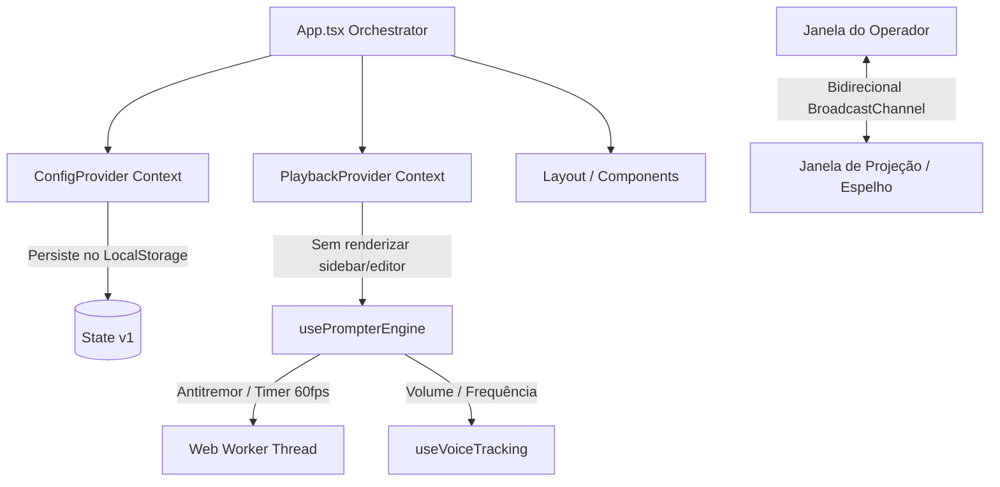

# 🏗️ Documento de Arquitetura - teleprompterIA

Este documento descreve a organização técnica, o fluxo de dados e os principais componentes arquiteturais do **teleprompterIA**.

---

## 1. Visão Geral da Arquitetura

O sistema é construído inteiramente como uma Single Page Application (SPA) usando **React 19**, **TypeScript** e **Vite**. A estilização é gerada em tempo de compilação via **Tailwind CSS v4** + PostCSS.

---

## 2. Separação de Estados (Prevenção de Renderização Excessiva)

Em versões anteriores, a atualização contínua do scroll e do volume do microfone causava re-renderizações em cascata por toda a árvore da aplicação, elevando o uso de CPU. Resolvemos isso dividindo o estado da aplicação em dois escopos:

### A. ConfigContext (`ConfigProvider`)
Contém as preferências e parâmetros estáticos do usuário que mudam infrequente ou sob demanda direta:
* Configurações de API (chaves do Gemini e do DeepSeek, modelo selecionado).
* Tamanhos de fonte do editor, margens de leitura e tema estético.
* Visibilidade de abas laterais e de diálogos (Settings, Docs).
* Largura e posições do editor de texto e painéis secundários.
* **Persistência**: Qualquer mudança neste estado atualiza e persiste a chave `teleprompteria_state_v1` no `localStorage`.

### B. PlaybackContext (`PlaybackProvider`)
Contém dados altamente voláteis que mudam várias vezes por segundo durante a reprodução do teleprompter:
* Estado de execução (`isPlaying`, `isVoiceMode`).
* Nível de volume do microfone (`volumeLevel`) detectado pelo analisador de áudio.
* Palavra ativa (`activeWordId`) e histórico de transcrição do microfone em tempo real.
* Instância do `BroadcastChannel`.
* **Benefício**: Os componentes pesados (como o `TextEditor` e o `LeftSidebar`) assinam apenas o `ConfigContext`. Eles permanecem estáticos e frios enquanto o texto rola na tela e a voz do orador é processada.

---

## 3. Sincronização de Janelas via `BroadcastChannel`

O teleprompterIA oferece suporte a uma janela externa de projeção (por exemplo, exibida em um espelho físico ou monitor secundário). Em vez de manipular o DOM de outra aba via ponteiros síncronos de Javascript (o que causava erros em fechamentos e quebras de segurança), implementamos comunicação baseada na API nativa **`BroadcastChannel`**.

* **Canal**: `teleprompteria-sync`
* **Fluxo**:
  1. A janela do operador publica mensagens como `{ type: 'SCROLL_SYNC', percentage }` ou `{ type: 'CONFIG_SYNC', ... }`.
  2. A tela de projeção (`/src/components/prompter/ProjectionView.tsx`) escuta essas mensagens e aplica a alteração no scroll ou no tema de forma reativa.
  3. Para evitar loop infinito de scroll (ecando mensagens de volta), criamos uma flag de throttle temporal (`isSyncingFromPopup.current`).

---

## 4. Mecanismo de Rolagem Suave (Smart Scroll & Web Worker)

As animações e rolagens baseadas no loop principal do React (como `requestAnimationFrame` síncrono ou timers Javascript normais) sofrem de gargalos causados pela coleta de lixo (garbage collection) e tarefas pesadas na thread de UI.

Para garantir rolagem absolutamente fluida (sem jitter ou microtravamentos) a 60 FPS:
1. **Web Worker Dedicado**: A engine de reprodução (`usePrompterEngine.ts`) inicia um Web Worker com um timer `setInterval` que roda em uma thread paralela a cada 16 milissegundos.
2. **Tick de Rolagem**: O Worker envia um evento `'tick'` para o gancho do React.
3. **Cálculo da Velocidade**: O gancho calcula o acúmulo de subpixels e aplica a rolagem ajustando `scrollTop`.
4. **Soberania do Operador**: Se o operador rodar o scroll do mouse ou usar gestos de touch, a IA ou o auto-scroll são pausados temporariamente por 3 segundos para que o comando humano prevaleça.
5. **Smart Scroll por Voz**: Quando o modo de voz está ativo, o scroll calcula a distância em pixels entre o elemento da palavra atualmente falada e a linha ideal de leitura (32% da altura da tela + deslocamento customizado). Um ajuste proporcional de velocidade (P-Controller) aproxima a tela da linha ideal suavemente.
