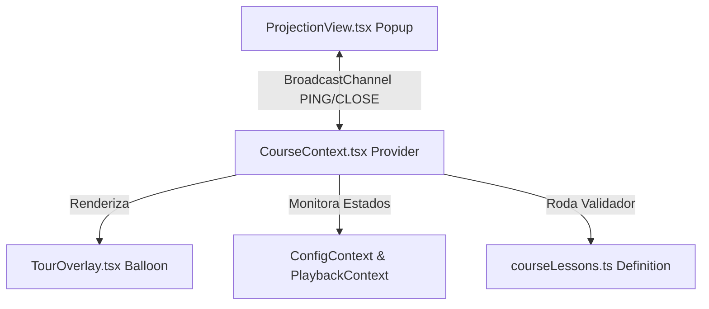

# 🎓 Guia do Curso Interativo - teleprompterIA

Este documento detalha o funcionamento técnico, a arquitetura e as regras de negócio que regem o **Curso Interativo** (`TELEPROMPTER_COURSE`) no **teleprompterIA**.

---

## 1. Visão Geral do Curso

O curso interativo foi projetado para guiar o usuário em uma trilha prática de aprendizado direto no painel do aplicativo. A experiência é dividida em duas fases principais:
1. **Fase de Onboarding (Informativa):** Introduz o manifesto do projeto e a filosofia de design. Estas etapas são do tipo `info` e habilitam o avanço livre.
2. **Fase de Laboratórios Práticos (Testes de Estado):** Desafia o usuário a interagir com os componentes na tela. O avanço só é liberado quando o validador programático detecta que o estado interno do app condiz com o objetivo proposto.

---

## 2. Arquitetura Técnica

O curso é implementado através de quatro arquivos principais:
* `src/constants/courseLessons.ts`: Definição de etapas, instruções, sub-tarefas e funções validadoras.
* `src/context/CourseContext.tsx`: Gerenciador de estado global do curso (etapa ativa, progresso de checkboxes, sincronização de atalhos e seleção de texto).
* `src/components/modals/TourOverlay.tsx`: Interface visual do balão (balloon) do curso, controle de gestos de arrastar e barra de progresso.
* `src/components/prompter/ProjectionView.tsx`: Envio de mensagens de vida/fechamento do lado da tela externa.

---

## 3. Mecanismos Especiais de Controle

### A. Prevenção de Desresets Destrutivos e Validação por Snapshot (`enterSettings`)
Para evitar que o tema preferido do usuário seja reiniciado ao entrar no Passo 5 (Configurações), o provedor utiliza a referência `enterSettings` (`useRef`):
* No momento em que o usuário entra no Passo 5, salvamos um snapshot do tema e da velocidade de rolagem iniciais.
* O validador da lição compara as configurações ativas com esse snapshot inicial.
* A tarefa é dada como concluída quando o usuário realiza alterações (muda de tema, muda o nome do app ou altera a velocidade) a partir de seu estado inicial, sem a necessidade de resetar forçadamente a interface para os padrões de fábrica.

### B. Heartbeat e Fechamento da Projeção Externa
Para rastrear se o usuário realmente abriu ou fechou a janela secundária de projeção no Passo 6:
* O provedor escuta mensagens do canal `BroadcastChannel` (`teleprompteria-sync`).
* Ao entrar no Passo 6, o curso limpa `isProjectionActive` e envia um ping `PING_PROJECTION`. Se a janela estiver aberta de uma sessão anterior, ela responde e se valida na hora.
* A janela de projeção (`ProjectionView.tsx`) escuta o evento `beforeunload` e envia uma mensagem `PROJECTION_CLOSED` ao ser fechada ou recarregada.
* Isso garante que a tarefa de projeção desmarque instantaneamente caso a janela seja fechada.

### C. Balão Flutuante Draggable e Responsivo
* **Arrastável:** O balão do curso em `TourOverlay.tsx` escuta eventos de ponteiro (`Pointer Events`) permitindo que o usuário o desloque livremente se ele estiver obstruindo algum botão ou texto.
* **Auto-reposicionamento:** O balão se alinha de forma inteligente:
  * Quando o menu lateral esquerdo ou o editor de texto são abertos, ele calcula a largura ativa (`textEditorWidth` + offsets) e se afasta para a direita.
  * Quando o modal central de configurações está aberto (`showSettings === true`), ele se move automaticamente para o canto superior direito da tela.
  * O balão retorna à sua posição original nas transições de etapas (Anterior/Próximo).

### D. Botão Avançar com Preenchimento Gradiente
O botão de avançar preenche seu plano de fundo com um gradiente linear proporcional ao número de sub-tarefas concluídas da lição ativa (ex: 33% preenchido com 1 de 3 tarefas feitas), servindo como uma barra de progresso interativa e visual.

---

## 4. Relação de Lições e Validação

Abaixo está a listagem sequencial de lições e as regras programáticas de suas validações:

| # | ID da Etapa | Tipo | Título da Lição | Elemento em Destaque | Lógica de Validação |
|---|-------------|------|-----------------|----------------------|---------------------|
| 1 | `intro_manifesto` | `info` | Bem-vindo ao teleprompterIA! | Nenhum | Livre |
| 2 | `intro_design_layout` | `info` | A Filosofia do Design | `.app-layout-grid` | Livre |
| 3 | `test_text_input` | `test` | Ingestão de Roteiro | `#btn-editor` | O editor deve estar aberto e o texto conter $\ge$ 15 palavras. Limpa o texto padrão inicial automaticamente na entrada do passo. |
| 4 | `test_text_selection_ai` | `test` | Edição Parcial com Copiloto | `#editor-textarea` | Três tarefas: 1. Selecionar texto (escutador de `selectionchange`); 2. Arrastar o balão (`dragPosition !== null`); 3. Usar a IA para alterar o roteiro original. |
| 5 | `test_settings_custom` | `test` | Customização Geral e de Marca | `#btn-theme` | Três tarefas baseadas no snapshot `enterSettings`: 1. Alterar empurrão de velocidade; 2. Alterar o nome do app; 3. Mudar preset ou cores customizadas. |
| 6 | `test_projection_mirror` | `test` | Projeção e Espelhamento | `#btn-popup` | Duas tarefas: 1. Abrir a janela externa (`isProjectionActive === true`); 2. Desativar espelhamento horizontal (`mirrorX === false`). |
| 7 | `test_manual_speed_font_margin` | `test` | Ajustes Estéticos (Velocidade, Fonte e Margem) | `#btn-speed` | Três tarefas: 1. Velocidade $\ne$ 30%; 2. Tamanho da Fonte $\ne$ 64px; 3. Margem lateral $>$ 0%. |
| 8 | `test_voice_mode_controls` | `test` | Modo de Voz e Ajustes de Foco | `#btn-voice` | Três tarefas: 1. Ativar o Modo de Voz (`isVoiceMode === true`); 2. Alterar o Filtro de Ruído (`noiseThreshold \ne 10`); 3. Alterar a Linha Guia (`voiceScrollOffset \ne 0%`). |
| 9 | `test_hide_sidebars` | `test` | Ocultar Menus (Modo Foco) | `.app-layout-grid` | O operador deve ocultar ambas as barras laterais (`leftSidebarOpen === false` e `rightSidebarOpen === false`). |
| 10 | `test_shortcuts_overlay` | `test` | Guia de Atalhos Flutuante | `.app-layout-grid` | Exibir o overlay flutuante de atalhos (`showShortcutOverlay === true`). |
| 11 | `test_global_shortcuts` | `test` | Teste de Atalhos Globais | `.app-layout-grid` | O usuário deve testar pressionando pelo menos 3 atalhos válidos (Espaço, V, R, B, `/`). |
| 12 | `course_complete` | `info` | Parabéns, Diretor! | `#developer-support` | Fim do curso. Direciona o foco para os links de suporte ao desenvolvedor. |

---

## 5. Como Estender ou Adicionar Etapas

Para criar uma nova lição ou laboratório no curso interativo:
1. Abra o arquivo [courseLessons.ts](file:///c:/Users/FGC/Desktop/programas/teleprompteria/src/constants/courseLessons.ts).
2. Adicione um novo objeto ao array `TELEPROMPTER_COURSE`.
3. Defina a propriedade `type: 'info'` para passos teóricos ou `type: 'test'` para desafios interativos.
4. Para desafios com múltiplos requisitos, defina um array de strings `tasks` e forneça a função `validateTasks` que deve retornar um array de booleanos correspondente às tarefas (de mesmo tamanho).
5. Certifique-se de que os estados avaliados estejam disponíveis no `CourseContext.tsx` e sejam passados corretamente na chamada do validador.
